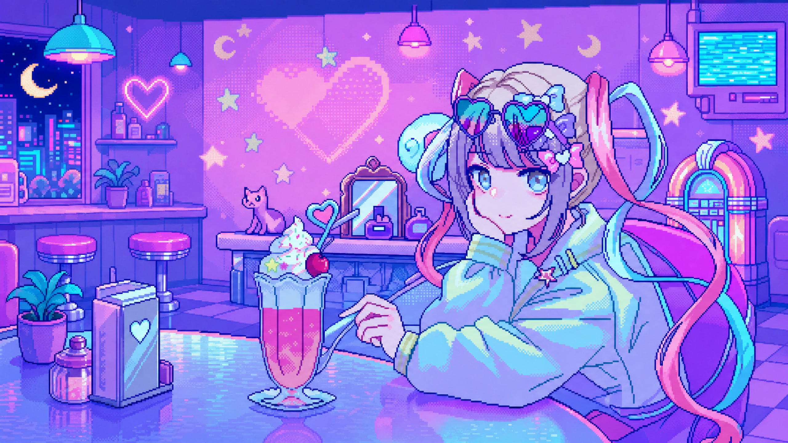

# Codex Dream Skin · INTERNET ANGEL

<p align="center">
  <a href="./README.md">中文</a> · <strong>English</strong>
</p>

<p align="center">
  <strong>An immersive INTERNET ANGEL theme for Codex Desktop.</strong><br>
  Native-control styling · Animated pixel decorations · Local theme management · Reversible CDP injection
</p>

<p align="center">
  <br>
  <sub>The default Windows theme asset; the runtime injection layer renders the controls, layout, and animation.</sub>
</p>

> Current fork release: `1.5.8` (2026-07-29). Windows is the primary development and verification platform. macOS and Linux support continue alongside upstream and fork contributions.

Installers are published through this fork's [GitHub Releases](https://github.com/EmiyaKatuz/Codex-Dream-Skin/releases).

## About this fork

This independent fork is based on [Fei-Away/Codex-Dream-Skin](https://github.com/Fei-Away/Codex-Dream-Skin). It redesigns Codex Desktop around the INTERNET ANGEL theme and adds platform-specific renderer overlays, responsive layout behavior, animated state presentation, local theme storage, and themed tray or menu-bar experiences.

The theme uses CDP on the local loopback interface. The official Codex package, `WindowsApps`, `app.asar`, and application signatures remain unchanged.

The current branch includes upstream `611c101` (`v1.5.6`). Future upstream changes will be reviewed and integrated around this fork's theme and compatibility requirements.

## Fork highlights

### Bundled themes

Fresh Windows installations enable the JPEG INTERNET ANGEL theme and seed two additional saved themes:

| Theme | Source | Role |
|------|------|------|
| INTERNET ANGEL | `theme.json` + `dream-reference.jpg` | Default `2560 × 1440` JPEG theme |
| INTERNET ANGEL · Pixel Cafe | `theme-choten.json` + `codex-dream-skin-pixel-cafe.png` | Lossless PNG edition |
| Gothic Void Crusade | `windows/presets/preset-gothic-void-crusade/` | Additional upstream preset |

The Windows release builder verifies the theme IDs, image mappings, and SHA-256 hashes before producing Setup.exe.

### Interface and runtime work

- A cyan, pink, purple, and pixel-neon visual system covers the home screen, tasks, header, sidebar, composer, settings, terminal, dialogs, pull requests, and secondary panels.
- ANGEL COMMAND DECK cards augment the home screen while preserving native Codex inputs and task creation.
- Responsive rules cover narrow and short windows, collapsed sidebars, bottom panels, split views, and full task pages.
- Background-synchronized blinking, heartbeat, signal, particle, and live-status effects respond to resizing and reduced-motion preferences.
- Renderer scans are throttled, window identity is verified, observers and listeners are cleaned up, and injection failures release their sessions.
- Codex Desktop 26.721+ home structures, native-window readiness, Safe CSS parts, and renderer cleanup have dedicated regression coverage.

### Theme management

- Import PNG, JPEG, or WebP backgrounds up to `10 MB`.
- Import theme ZIP archives with manifest, path, size, platform, client-version, SHA-256, and Safe CSS validation.
- Save and switch local themes from the Windows tray or macOS menu bar.
- Pause, resume, reapply, inspect theme folders, check for updates, or fully restore the stock Codex appearance.
- Open DreamSkin.cc Gallery and Studio from the client. Supported community links require local confirmation before application.
- Windows Setup, shortcuts, uninstall metadata, protocol registration, and tray now share a multi-size INTERNET ANGEL icon redrawn to match the Pixel Cafe character. The macOS app and DMG use the same artwork.

### 1.5.8 pull requests, compatibility, and security

- PR #8 brings the INTERNET ANGEL overlay, Command Deck, animated state presentation, responsive layout, and regression coverage to macOS.
- PR #10 restricts the Windows native-window fallback to exact known window-not-found responses. Other `-32000` responses, bounds failures, aborted connections, and timeouts remain fail-closed.
- PR #12 moves Command Deck down with available height on wide Windows home layouts, keeping compact and split layouts unchanged.
- Upstream `1.5.6` removes the Node.js environment override that could bypass validators, validates trusted Node.js signatures before execution, preserves `$` sequences during payload construction, redacts macOS page metadata from logs, and blocks releases before tagging when portable regressions fail.
- Release Setup still includes its pinned, hash-validated Node.js runtime. End users do not need a separate Node.js installation.

### 1.5.7 issue fixes and compatibility

- Issue #2 is fixed: Windows configuration transactions preserve valid multiline TOML arrays across root, `[desktop]`, and unrelated tables. Malformed arrays, multiline managed appearance values, and multiline strings still fail before any write.
- Issue #6 fails during Appx identity preflight. The reported installation did not expose a current-user package satisfying the `OpenAI.Codex` name, Microsoft Store signature, non-development mode, unique manifest `app\ChatGPT.exe`, and valid AUMID checks. The report does not include enough package-manifest evidence to expand that allowlist safely, so 1.5.7 keeps the complete identity boundary.
- Confirmed owl production runtimes `26.715.10079.0` and `26.721.3404.0` cannot expose the required loopback CDP endpoint within this project's safety boundary. The launcher cleans up the attempted session and reopens ordinary Codex.

## Install

### Windows Release Setup

Requirements: Windows 10/11 x64 and the Microsoft Store `OpenAI.Codex` app registered for the current user. Launch Codex once, then close Codex and any older Dream Skin tray process.

If Setup reports that the official Store package is missing or cannot be validated, confirm that Codex came from Microsoft Store, is registered for the current Windows user, and has launched successfully at least once. Dream Skin does not change WindowsApps permissions or skip package identity checks.

1. Download `CodexDreamSkin-Setup-vX.Y.Z.exe` and `SHA256SUMS.txt` from the [latest release](https://github.com/EmiyaKatuz/Codex-Dream-Skin/releases/latest).
2. Verify the Setup.exe SHA-256 against the checksum file.
3. Run the per-user installer and launch `Codex Dream Skin` from the Start menu.

Setup includes a pinned Node.js runtime. Source checkout and a separate Node.js installation are unnecessary for Release users. Current packages are unsigned; verify the source and checksum before approving a Windows security prompt. See the [Windows installation guide](./docs/install-windows.md) for updates, ZIP import, recovery, and uninstall steps.

### Windows from source

Source installation requires Node.js 22 or newer plus Windows PowerShell 5.1 or PowerShell 7:

```powershell
powershell.exe -NoProfile -ExecutionPolicy RemoteSigned -File .\windows\scripts\install-dream-skin.ps1
```

The installer deploys a managed runtime under `%LOCALAPPDATA%\CodexDreamSkin`, starts the tray, and creates the `Codex Dream Skin`, `Codex Dream Skin - Tray`, and `Codex Dream Skin - Restore` desktop shortcuts.

### macOS

Download `CodexDreamSkin-vX.Y.Z.dmg`, move `Codex Dream Skin.app` to Applications, and launch it. The DMG includes its runtime. Current builds use ad-hoc signing; follow the GUI approval steps in the [macOS installation guide](./docs/install-macos.md).

### Linux

Linux support is tested with the AUR [`openai-codex-desktop`](https://aur.archlinux.org/packages/openai-codex-desktop) package and requires Node.js 20 or newer:

```bash
./linux/scripts/install-dream-skin-linux.sh
```

See [`linux/README.md`](./linux/README.md) for verification, restore, release archive, and custom-path details.

## Update and restore

Release users can close Codex and the tray, verify the new package checksum, and install the newer package over the existing installation. Active themes, saved themes, imported images, and configuration backups are preserved.

Source users can pull this fork and run the source installer again. The Restore shortcut removes the injected appearance and returns Codex to its stock presentation.

## Verification

Run the Windows regression suite:

```powershell
powershell.exe -NoProfile -ExecutionPolicy RemoteSigned -File .\windows\tests\run-tests.ps1
```

Check the final Windows injection payload:

```powershell
node .\windows\scripts\injector.mjs --check-payload
```

Tests cover theme seeding and switching, image and ZIP validation, Safe CSS, community recovery, runtime replacement, installer rules, selector contracts, pause and resume, responsive layouts, native-window readiness, renderer cleanup, payload revision, and loopback CDP validation.

## Roadmap

- Add more animation variants for states such as thinking and output.
- Maintain compatibility with major Codex Desktop releases and reviewed upstream updates.
- Continue miscellaneous reliability and presentation fixes.

## License and notice

- This project follows the upstream license; see [`macos/LICENSE`](./macos/LICENSE) and [`macos/NOTICE.md`](./macos/NOTICE.md).
- This is an unofficial product. Codex and related rights belong to their respective owners.
- IP materials and trademarks used by this theme belong to their respective owners.
- Confirm the required rights before public display or redistribution of people, IP materials, and trademarks.

## Credits

- Original project: [Fei-Away/Codex-Dream-Skin](https://github.com/Fei-Away/Codex-Dream-Skin)
- Gothic Void Crusade contributor: [@seansong-ideogram](https://github.com/seansong-ideogram)

---

Turn the Codex workspace into the INTERNET ANGEL stream room.
