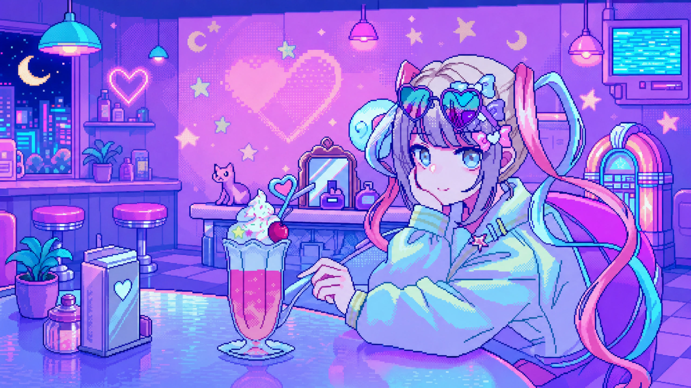

# Codex Dream Skin · 超天酱主题

<p align="center">
  <strong>为 Codex Desktop 制作的超天酱 / INTERNET ANGEL 沉浸式主题。</strong><br>
  原生控件换肤 · 动态像素装饰 · 本地主题管理 · 不修改官方安装包
</p>

<p align="center">
  <br>
  <sub>Windows 默认主题素材；界面、动画与控件皮肤由运行时注入层生成</sub>
</p>

> 当前 fork 版本：`1.3.4`。主要开发与验证平台为 Windows；macOS 能力继承自上游项目并继续保留。

## 这是什么

这是基于 [Fei-Away/Codex-Dream-Skin](https://github.com/Fei-Away/Codex-Dream-Skin) 开发的独立 fork。当前版本围绕「超天酱 · INTERNET ANGEL」重新设计了 Windows Codex Desktop 的视觉、交互与主题管理体验。

侧栏、任务、建议卡、项目选择、输入框、设置和终端等 Codex 原生控件会直接呈现主题样式。主题通过仅绑定本机回环地址的 CDP 注入，不修改 `WindowsApps`、`app.asar`、应用签名或官方二进制。

本 fork 将作为独立项目继续开发。上游后续更新会按需同步，再以本项目的超天酱功能和视觉实现为准进行整合。

## 本 Fork 的主要改动

### 超天酱主题已固定为 Windows 默认体验

首次初始化会自动创建三套可切换主题：

| 主题 | 资源 | 说明 |
|------|------|------|
| 超天酱 · INTERNET ANGEL | `theme.json` + `dream-reference.jpg` | 默认启用的 `2560 × 1440` JPEG 版 |
| 超天酱 · INTERNET ANGEL · Pixel Cafe | `theme-choten.json` + `codex-dream-skin-pixel-cafe.png` | 保留原始构图的无损 PNG 版 |
| Gothic Void Crusade | `windows/presets/preset-gothic-void-crusade/` | 随上游更新保留的附加预设 |

两套超天酱主题会以不同名称显示在托盘的「已保存主题」菜单中，不需要手动跨目录导入。

### 全界面视觉重制

- 以青色、粉色、紫色和像素霓虹为核心，统一首页、任务页和原生顶栏的视觉语言。
- 为首页加入 ANGEL COMMAND DECK 指令卡，并保留 Codex 原生输入和任务创建能力。
- 适配设置、插件、站点、计划任务、Pull Requests、选择工具栏和系统提示。
- 适配终端、侧边对话、变更摘要、编辑资源卡、子代理面板和 composer 菜单。
- 对窄窗口、矮窗口、侧栏展开、底部面板展开和双面板状态提供独立响应式布局。
- 保留原生控件的点击、滚动、键盘操作和可访问性行为；装饰层不拦截鼠标事件。

### 动画与状态表现

- 为超天酱背景加入与图片几何位置同步的眨眼、心跳、信号、粒子和直播状态装饰。
- 窗口缩放、侧栏收起或最大化时会重新计算动效位置，避免装饰与人物错位。
- 支持系统「减少动态效果」偏好，并在空间不足或面板展开时自动隐藏次要动画。
- 暂停、继续和重新应用主题时，会在 Codex 主界面显示 loading、成功或失败状态。

### 更完整的主题管理

- 使用专门设计的超天酱多尺寸像素托盘图标。
- 支持导入 PNG、JPEG、WebP 背景，并保存为本地主题。
- 支持从托盘快速切换已保存主题、暂停、继续、重新应用和完整恢复。
- 暂停会立即卸下当前窗口皮肤；继续会清除暂停状态并立即重新应用。
- watcher 会根据主题配置和图片内容修订值进行热更新，renderer 重载后仍能恢复当前主题。

### 合并的可靠性修复

- 收起或重建左侧栏时继续保留主题，避免短暂闪回 Codex 原生配色。
- 只在确认主 Codex 窗口后应用皮肤，宠物等透明辅助窗口会清理残留背景。
- 导入和注入前校验图片格式、尺寸、像素总量和文件大小。
- 主题仓库、状态文件、恢复流程和运行时替换保留原子写入与路径边界检查。

## 快速开始（Windows）

### 要求

- Windows 10/11
- 已安装官方 Codex Desktop
- Node.js 22 或更高版本
- PowerShell 5.1 或 PowerShell 7

### 安装

先关闭 Codex 与旧版 Dream Skin 托盘，然后在仓库根目录运行：

```powershell
powershell.exe -NoProfile -ExecutionPolicy RemoteSigned -File .\windows\scripts\install-dream-skin.ps1
powershell.exe -NoProfile -ExecutionPolicy RemoteSigned -File .\windows\scripts\start-dream-skin.ps1
```

安装器会把运行时原子复制到 `%LOCALAPPDATA%\CodexDreamSkin\engine`，并创建启动、恢复和托盘快捷方式。安装完成后，运行时不依赖当前源码目录的位置。

### 日常使用

打开 `Codex Dream Skin - Tray`：

- 从「已保存主题」切换默认版、Pixel Cafe 或 Gothic Void Crusade。
- 使用「更换背景图」导入自己的纯背景，再选择「保存当前主题」。
- 使用「暂停皮肤」立即恢复当前窗口的原生外观。
- 使用「继续显示皮肤」或「应用或重新应用」恢复主题。
- 使用「完全恢复 Codex」清理 Dream Skin 状态并回到官方外观。

导入图片必须是纯背景，不要使用包含窗口、侧栏、输入框、文字或按钮的效果截图。图片最大 `16 MB`，单边不超过 `16384` 像素，总像素不超过 `5000 万`。

## 更新

本 fork 后续更新时：

1. 退出 Dream Skin 托盘并关闭 Codex。
2. 拉取本 fork 的最新代码。
3. 重新运行安装脚本，让受管运行时、安全检查和快捷方式一起更新。
4. 再运行启动脚本。

重装不会删除 `%LOCALAPPDATA%\CodexDreamSkin` 中已有的活动主题、自定义主题和导入图片。

## 验证

运行 Windows 完整回归：

```powershell
powershell.exe -NoProfile -ExecutionPolicy RemoteSigned -File .\windows\tests\run-tests.ps1
```

检查最终注入 payload：

```powershell
node .\windows\scripts\injector.mjs --check-payload
```

测试覆盖主题播种与切换、图片校验、运行时替换、状态安全、暂停/恢复、侧栏折叠、响应式首页、renderer 清理和 CDP 回环验证。

## 目录说明

| 路径 | 内容 |
|------|------|
| [`windows/assets/`](./windows/assets/) | 超天酱背景、托盘图标、CSS、renderer 注入代码和主题配置 |
| [`windows/scripts/`](./windows/scripts/) | 安装、启动、恢复、主题仓库、托盘与 CDP 注入逻辑 |
| [`windows/tests/`](./windows/tests/) | Windows 与 renderer 回归测试 |
| [`windows/README.md`](./windows/README.md) | Windows 详细操作说明 |
| [`windows/CHANGELOG.md`](./windows/CHANGELOG.md) | 超天酱版本更新记录 |
| [`docs/platforms.md`](./docs/platforms.md) | 平台差异与主题格式说明 |
| [`macos/`](./macos/) | 继承并维护的上游 macOS 实现 |

## 未来计划

- 会加入更多动画，以显示不同状态下的差分（思考、输出等）
- 会随 Codex Desktop 主版本及原始项目更新作长期维护
- 更多的杂项修复

## 安全边界

- CDP 只绑定 `127.0.0.1`；主题运行期间不要执行来源不明的本机程序。
- 不修改 Codex 官方安装目录、`app.asar`、WindowsApps 内容或代码签名。
- 不读取或改写 API Key、Base URL 和模型供应商配置。
- 用户图片与主题配置保存在本机，不依赖外部 AI/API 分析。
- 可随时使用恢复脚本撤销主题并回到官方外观。

## 许可与声明

- 本项目沿用上游许可；详见 [`macos/LICENSE`](./macos/LICENSE) 与 [`macos/NOTICE.md`](./macos/NOTICE.md)。
- 非 OpenAI 官方产品；Codex 及相关权利归其权利人。
- 本主题/皮肤中所涉及的 IP 素材与商标权利归其权利人。
- 使用、公开展示或再分发人物、IP 素材与商标前，请自行确认所需授权。

## 致谢

- 原始项目：[Fei-Away/Codex-Dream-Skin](https://github.com/Fei-Away/Codex-Dream-Skin)
- Gothic Void Crusade 原创主题贡献者：[@seansong-ideogram](https://github.com/seansong-ideogram)

---

让 Codex 工作台成为超天酱的直播间。
